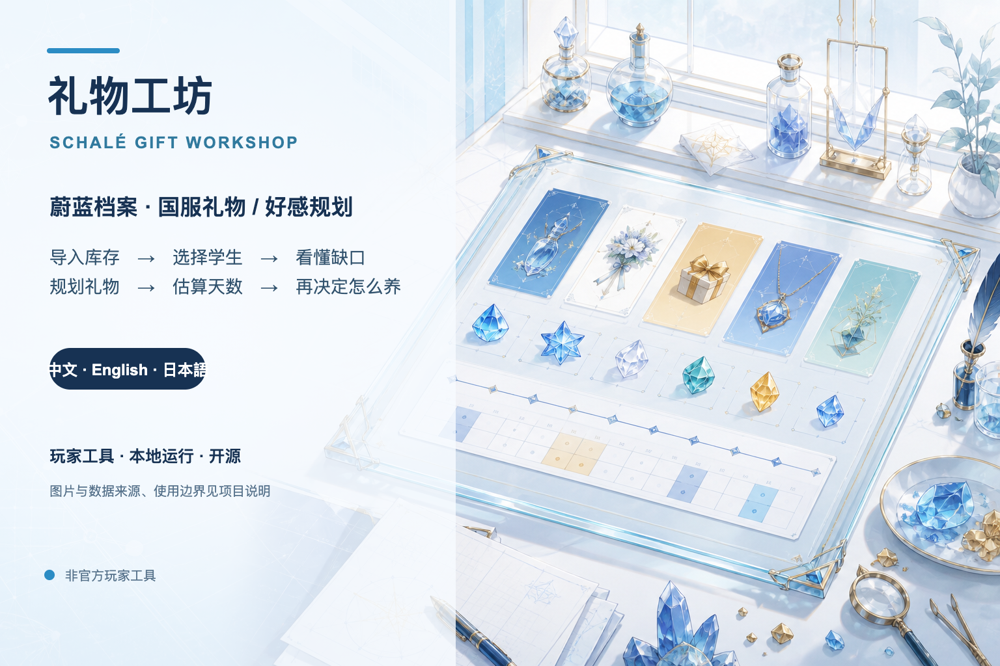
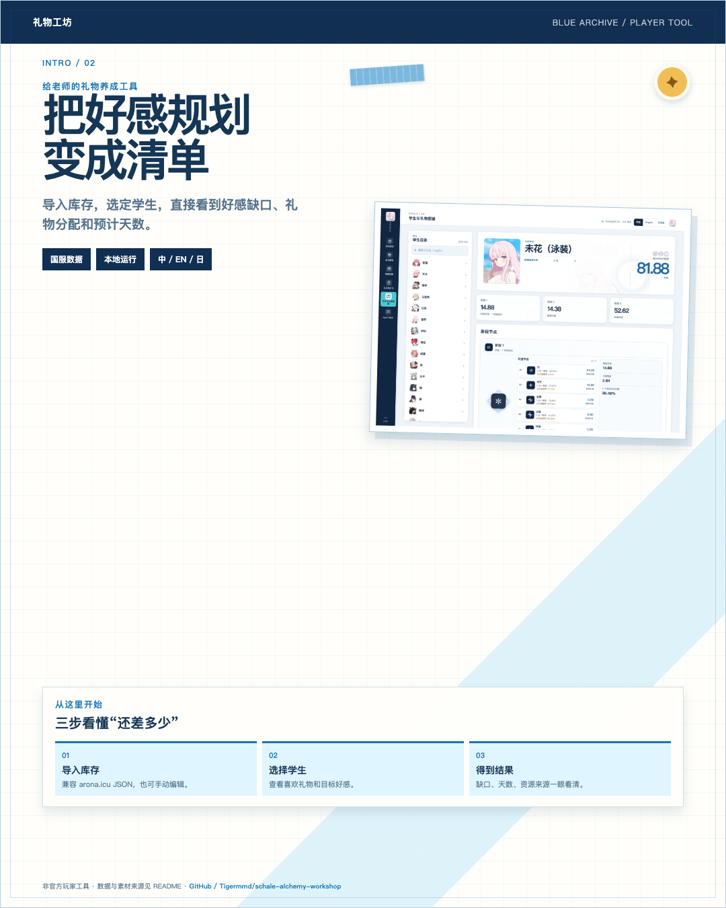
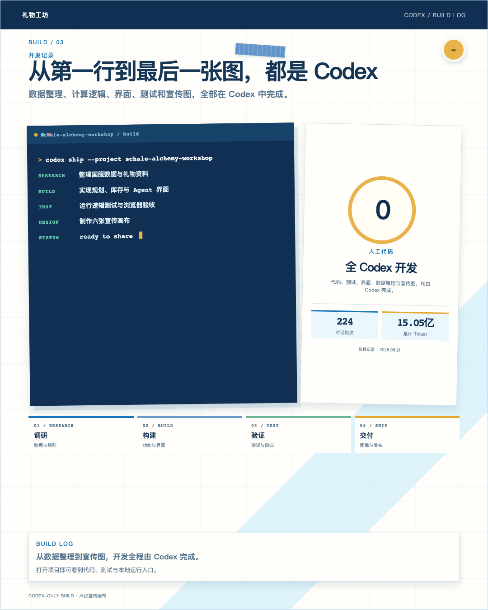
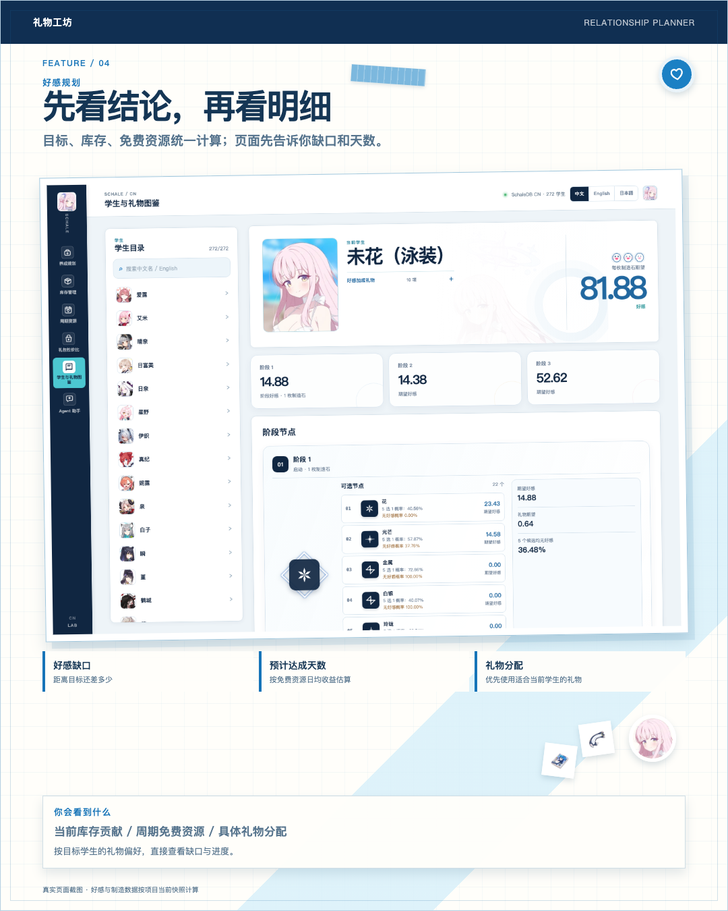
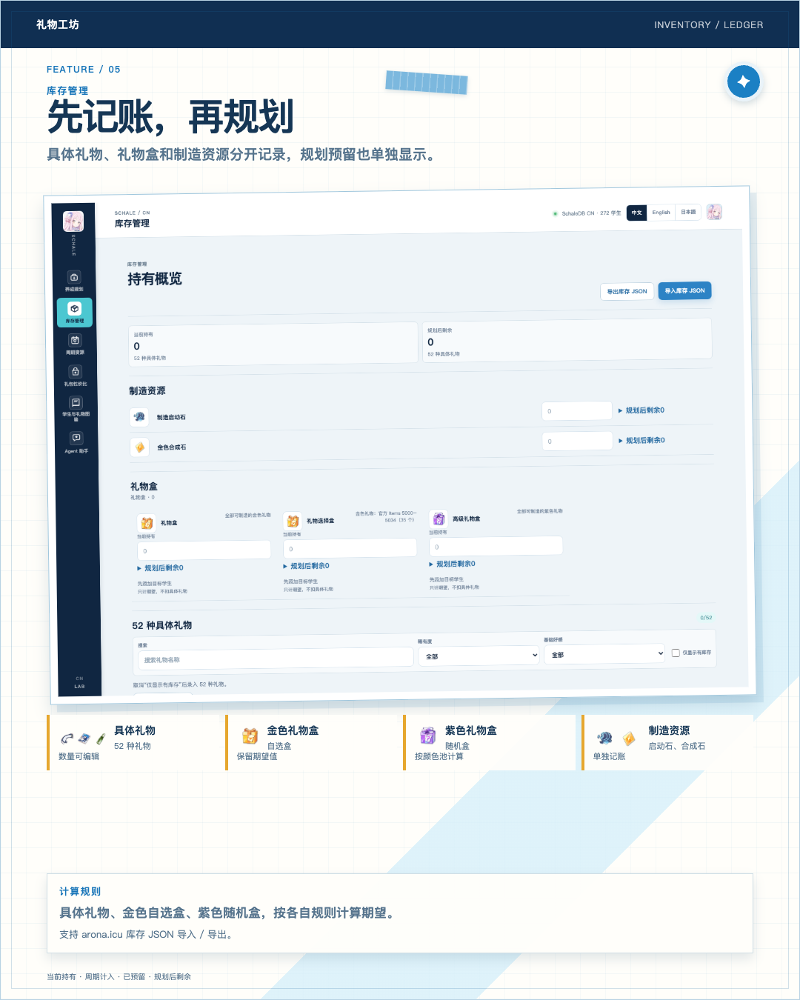
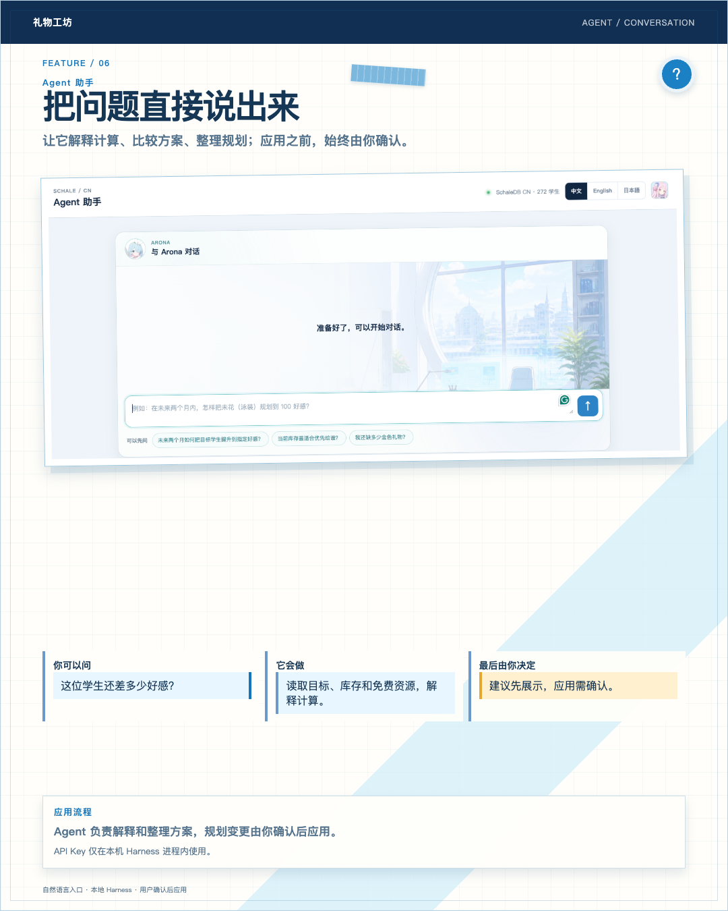
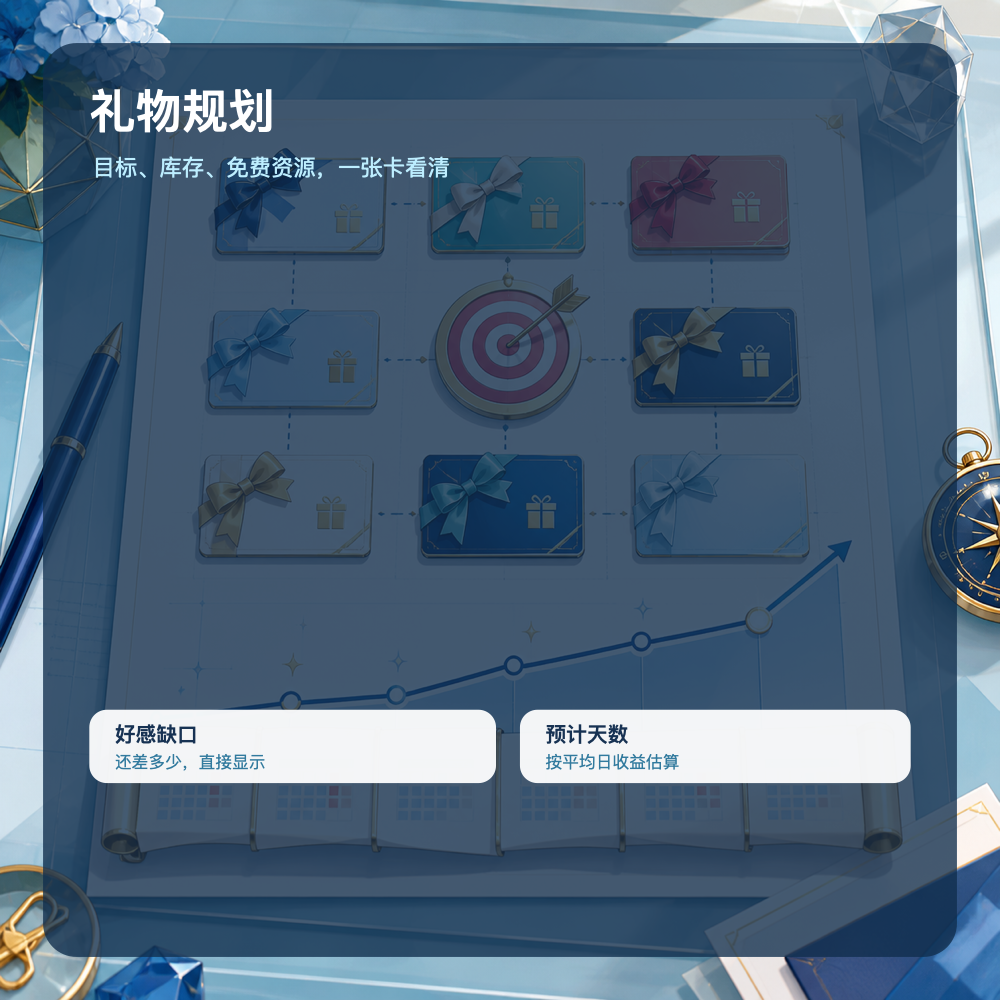
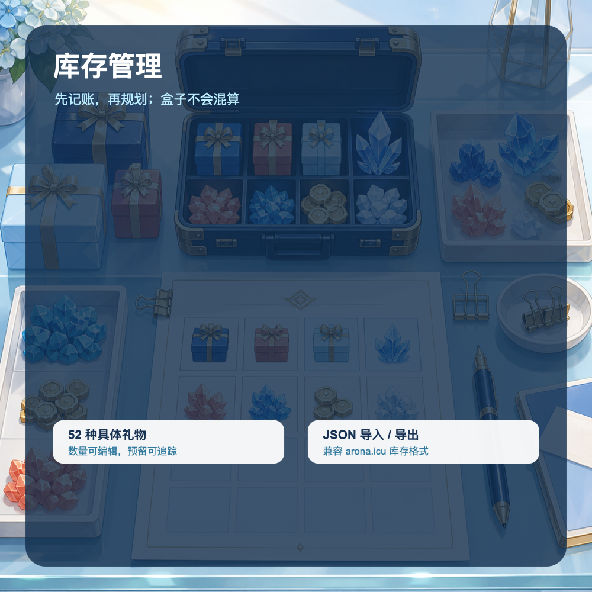

# 礼物工坊｜首发宣传包

## 主视觉

## 手帐滑动图（6 页 · 4:5）

可编辑源：[scrapbook/preview.html](scrapbook/preview.html)。图中页面使用项目真实截图，学生头像、礼物图标和界面素材来自仓库缓存；底图为本项目宣传用原创装饰素材。

推荐配文：

> 礼物工坊
> 给蔚蓝档案玩家用的国服礼物 / 好感规划工具。
> 导入库存，选定学生，直接看好感缺口和预计天数。
> GitHub：<https://github.com/Tigermmd/schale-alchemy-workshop>

## 三张功能图

| 规划 | 库存 | Agent |
|---|---|---|
|  |  |  |

## NGA / TapTap / 小黑盒

标题：

> 做了一个蔚蓝档案国服礼物好感规划工具：礼物工坊

正文：

> 导入自己的礼物库存，选择目标学生，就能看到：
> 还差多少好感
> 按当前库存和免费资源预计需要多少天
> 哪些礼物更适合优先使用
> 支持中文、English、日本語，兼容 arona.icu 库存 JSON。
> 项目地址：<https://github.com/Tigermmd/schale-alchemy-workshop>
> 本地运行，不需要注册账号。非官方玩家工具。

配图顺序：开场主视觉 → 功能导入 → 全 Codex 开发 → 规划 → 库存 → Agent。

## B站视频

标题：

> 你的未花还差多少好感？我做了个蔚蓝档案礼物规划器

时长：45～60 秒。

分镜：

1. 0～5 秒：展示开场主视觉，字幕“礼物工坊”。
2. 5～15 秒：导入 arona.icu 库存 JSON，字幕“库存不用重新录”。
3. 15～30 秒：选择学生和目标等级，展示“好感缺口 / 预计达成天数”。
4. 30～42 秒：切到库存页，展示礼物、礼物盒、预留和剩余分开记录。
5. 42～52 秒：切到 Agent 对话，展示“建议先确认，再应用”。
6. 52～60 秒：展示 GitHub 地址和三语切换。

简介：

> 礼物工坊：蔚蓝档案国服礼物与好感规划工具。
> 导入库存 → 选择学生 → 看缺口和预计天数。
> GitHub：<https://github.com/Tigermmd/schale-alchemy-workshop>

## 动态 / 短帖

> 做了个《蔚蓝档案》礼物规划工具。
> 导入库存，选目标学生，直接看还差多少好感、预计要多少天。
> 还兼容 arona.icu 库存 JSON。
> 礼物工坊：<https://github.com/Tigermmd/schale-alchemy-workshop>

## 评论区固定回复

**需要上传库存吗？**

> 不需要上传到服务器。库存默认保存在浏览器本地，也可以导入和导出 JSON。

**支持哪些服务器？**

> 当前规划以国服为主，界面支持中文、English、日本語。

**和官方有关系吗？**

> 没有。这是非官方玩家工具，数据和图片来源、使用边界见仓库说明。

**Agent 如何应用规划建议？**

> Agent 读取当前规划并生成建议，玩家确认后由网页应用变更。

## 发布前只检查这四项

- [ ] 开场主视觉与六张手帐图能正常打开。
- [ ] 演示视频使用脱敏库存，不展示 API Key 或个人数据。
- [ ] 帖子正文保留 GitHub 地址和“非官方玩家工具”。
- [ ] 发布前重新确认 README 中的数据来源与第三方内容说明。
